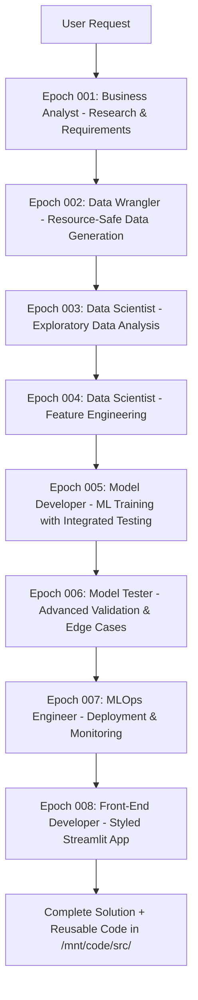

# Domino Data Lab Claude Code Agents

## Overview

This collection of Claude Code agents provides comprehensive support for building end-to-end machine learning demonstrations on the Domino Data Lab platform. Each agent specializes in a specific aspect of the ML lifecycle, and they work together to create production-ready solutions with governance compliance, resource-safe execution, and automated code reusability.

All agents are powered by **Claude Sonnet 4.5** (`claude-sonnet-4-5-20250929`) for optimal performance and capabilities.

## Agent Roles & Responsibilities

### Requirements & Research (Epoch 001)
- **Business-Analyst-Agent** (green): Translates business needs into technical requirements, conducts research, creates executive reports, uses `{project}_data` MLflow experiment, extracts research utilities to `/mnt/code/src/`

### Data Acquisition (Epoch 002)
- **Data-Wrangler-Agent** (red): Finds or generates data with resource management (50MB limit, 12GB RAM monitoring), uses `{project}_data` MLflow experiment, saves to `/mnt/data/{DOMINO_PROJECT_NAME}/`, extracts data utilities to `/mnt/code/src/`

### Data Analysis & Feature Engineering (Epochs 003-004)
- **Data-Scientist-Agent** (blue):
  - **Epoch 003**: Performs exploratory data analysis with memory limits, statistical analysis, visualizations
  - **Epoch 004**: Engineers features, creates transformations, encodes variables, scales data
  - Uses `{project}_data` MLflow experiment, extracts feature engineering utilities to `/mnt/code/src/`

### Model Development & Validation (Epochs 005-006)
- **Model-Developer-Agent** (orange): Develops, trains, and optimizes ML models with integrated testing, uses `{project}_model` MLflow experiment, extracts model utilities to `/mnt/code/src/`
- **Model-Tester-Agent** (purple): Advanced testing including edge cases, compliance, robustness validation, uses `{project}_model` MLflow experiment, extracts testing utilities to `/mnt/code/src/`

### Deployment & Applications (Epochs 007-008)
- **MLOps-Engineer-Agent** (yellow): Creates deployment pipelines, monitoring, uses `{project}_model` MLflow experiment, extracts deployment utilities to `/mnt/code/src/`
- **Front-End-Developer-Agent** (cyan): Builds Streamlit applications with standardized styling, uses `{project}_model` MLflow experiment, extracts UI utilities to `/mnt/code/src/`

### Documentation
- **Agent-Interaction-Protocol**: Reference for how agents communicate with each other
- **Example-Demonstration-Flows**: Sample workflows showing file organization and MLflow integration

## Domino Documentation Reference

**Complete Domino Data Lab documentation is available at:**
- `/mnt/code/.reference/docs/DominoDocumentation.md` - Full platform documentation
- `/mnt/code/.reference/docs/DominoDocumentation6.1.md` - Version 6.1 specific docs

**All agents have access to this documentation and will reference it for:**
- Workspaces and compute environments
- Data sources and datasets
- Jobs and scheduled executions
- MLflow integration and experiment tracking
- Model APIs and deployment
- Apps and dashboards
- Domino Flows for pipeline orchestration
- Hardware tiers and resource management
- Environment variables and secrets management

## New Features

### 🆕 Resource Management (Prevents Workspace Crashes)
- **50MB File Size Limit**: All data files automatically limited to prevent disk issues
- **12GB RAM Monitoring**: Continuous memory monitoring with psutil during data generation
- **Chunked Processing**: 10K rows per chunk to prevent memory spikes
- **Automatic Sampling**: Reduces data when limits exceeded
- **Real-time Progress**: "Generated X/Y rows (Memory: Z GB)"

### 🆕 Directory Validation
- **Automatic validation** of `/mnt/data/{DOMINO_PROJECT_NAME}/`
- **User prompts** if directory doesn't exist with options:
  - Type `create` to auto-create directory
  - Enter custom path if different location needed
- **No silent failures** - agents won't proceed without valid directory

### 🆕 Code Extraction to `/mnt/code/src/` (Shared Across Projects)
All agents extract reusable code at epoch completion to a shared directory:
- **Epoch 001**: `research_utils.py` - Requirements and research utilities
- **Epoch 002**: `data_utils.py` - Data processing and validation utilities
- **Epoch 003**: (No extraction - EDA focuses on analysis and visualization)
- **Epoch 004**: `feature_engineering.py` - Feature engineering and transformation utilities
- **Epoch 005**: `model_utils.py` - Model training and testing utilities
- **Epoch 006**: `evaluation_utils.py` - Advanced testing and validation utilities
- **Epoch 007**: `deployment_utils.py` - Deployment and monitoring utilities
- **Epoch 008**: `ui_utils.py` - UI components and visualization utilities
- Single shared location `/mnt/code/src/` with `__init__.py`

### 🆕 Streamlit Styling Standards
- **Professional muted theme**: #BAD2DE, #CBE2DA, #E5F0EC
- **Semantic UI integration**: Consistent card components
- **Wide layout**: Full-width responsive design
- **Performance caching**: `@st.experimental_singleton`, `@st.experimental_memo`
- **3-column grids**: Responsive KPI displays
- **Custom components**: Styled cards, formatting utilities

## Typical Workflow (User as Project Manager - 8 Epochs)



**User manually triggers each epoch** - no central orchestrator

## How to Use the Agents (Epoch-by-Epoch Guide)

### Epoch 001: Research & Planning
**Agent**: Business-Analyst-Agent | **Duration**: 1-2 hours | **Experiment**: `{project}_data`

**Command**: `"Analyze requirements for [use case] with [industry] regulations"`

**What Happens**:
- Conducts domain and regulatory research
- Identifies compliance frameworks (GDPR, HIPAA, NIST RMF)
- Recommends technology stack and architectures
- Generates executive research report

**Outputs**: Requirements doc, research report, `/mnt/code/src/research_utils.py`

---

### Epoch 002: Data Acquisition
**Agent**: Data-Wrangler-Agent | **Duration**: 2-4 hours | **Experiment**: `{project}_data`

**Command**: `"Generate synthetic [domain] data with [features] and [rows]"`

**What Happens**:
- Validates `/mnt/data/{DOMINO_PROJECT_NAME}/` exists (prompts if missing)
- Generates data in 10K-row chunks with memory monitoring
- Enforces 50MB file size limit (samples if needed)
- Logs to MLflow with quality metrics

**Outputs**: `synthetic_data.parquet` (≤50MB), quality report, `/mnt/code/src/data_utils.py`

**Critical Features**:
- **12GB RAM limit**: Prevents workspace crashes
- **50MB file limit**: Automatic sampling
- **Chunked processing**: Progress shown with memory usage

---

### Epoch 003: Exploratory Data Analysis
**Agent**: Data-Scientist-Agent | **Duration**: 2-3 hours | **Experiment**: `{project}_data`

**Command**: `"Perform EDA on [dataset] focusing on [target]"`

**What Happens**:
- Loads data from Epoch 002
- Statistical analysis and distribution checks
- Correlation matrices and relationship visualization
- Identifies patterns for feature engineering

**Outputs**: EDA notebook, visualizations, insights report

**Note**: No code extraction - pure analysis stage

---

### Epoch 004: Feature Engineering
**Agent**: Data-Scientist-Agent | **Duration**: 2-3 hours | **Experiment**: `{project}_data`

**Command**: `"Engineer features for [task] using [strategy]"`

**What Happens**:
- Uses insights from Epoch 003 EDA
- Creates derived features (interactions, aggregations)
- Encodes categoricals (one-hot, target, ordinal)
- Scales numericals (standardization, normalization)
- Splits into train/val/test sets

**Outputs**: `engineered_features.parquet`, feature report, `/mnt/code/src/feature_engineering.py`

---

### Epoch 005: Model Development
**Agent**: Model-Developer-Agent | **Duration**: 3-5 hours | **Experiment**: `{project}_model`

**Command**: `"Train [algorithms] for [task] with hyperparameter tuning"`

**What Happens**:
- Trains multiple algorithms (linear, trees, ensembles, neural nets)
- Hyperparameter optimization (grid/random/Bayesian)
- Cross-validation and performance tracking
- **Integrated testing**: Confusion matrices, ROC, basic metrics
- All logged to MLflow

**Outputs**: Trained models, comparison report, `/mnt/code/src/model_utils.py`

**MLflow Switch**: From this epoch onward, uses `{project}_model` experiment

---

### Epoch 006: Model Testing
**Agent**: Model-Tester-Agent | **Duration**: 2-4 hours | **Experiment**: `{project}_model`

**Command**: `"Run comprehensive testing on [model] including fairness"`

**What Happens**:
- **Functional testing**: Business requirements verification
- **Performance testing**: Latency, throughput, resource usage
- **Edge case testing**: Boundary conditions, adversarial inputs
- **Fairness testing**: Bias across demographics
- **Compliance testing**: Regulatory validation

**Outputs**: Test report, compliance cert, `/mnt/code/src/evaluation_utils.py`

---

### Epoch 007: Deployment & MLOps
**Agent**: MLOps-Engineer-Agent | **Duration**: 3-5 hours | **Experiment**: `{project}_model`

**Command**: `"Deploy [model] with monitoring and API serving"`

**What Happens**:
- Creates deployment pipeline (Docker, K8s, Domino)
- Sets up drift detection and performance monitoring
- Builds FastAPI/Flask serving endpoints
- Configures CI/CD for retraining

**Outputs**: Deployment pipeline, monitoring dashboard, API, `/mnt/code/src/deployment_utils.py`

---

### Epoch 008: Application & Retrospective
**Agent**: Front-End-Developer-Agent | **Duration**: 2-4 hours | **Experiment**: `{project}_model`

**Command**: `"Build Streamlit dashboard for [task] with predictions"`

**What Happens**:
- Creates Streamlit app with standardized styling
- **Theme**: #BAD2DE (table), #CBE2DA (view), #E5F0EC (mv)
- **Layout**: Wide, 3-column grids, Semantic UI
- **Features**: Real-time predictions, caching, session state
- Generates `app.py` and `style.css`

**Outputs**: Interactive dashboard, `/mnt/code/src/ui_utils.py`

---

## Quick Reference Card

| Epoch | Agent | MLflow Experiment | Key Output | Code Extraction |
|-------|-------|-------------------|------------|-----------------|
| 001 | Business-Analyst | `{project}_data` | Research report | `research_utils.py` |
| 002 | Data-Wrangler | `{project}_data` | Data (≤50MB) | `data_utils.py` |
| 003 | Data-Scientist | `{project}_data` | EDA insights | None |
| 004 | Data-Scientist | `{project}_data` | Engineered features | `feature_engineering.py` |
| 005 | Model-Developer | `{project}_model` | Trained models | `model_utils.py` |
| 006 | Model-Tester | `{project}_model` | Test report | `evaluation_utils.py` |
| 007 | MLOps-Engineer | `{project}_model` | Deployment | `deployment_utils.py` |
| 008 | Front-End-Developer | `{project}_model` | Streamlit app | `ui_utils.py` |

## File Organization

All agents follow a standardized directory structure:

```
/mnt/
├── code/
│   ├── src/                             # Shared reusable code (all projects)
│   │   ├── __init__.py
│   │   ├── research_utils.py            # Epoch 001
│   │   ├── data_utils.py                # Epoch 002
│   │   ├── feature_engineering.py       # Epoch 004
│   │   ├── model_utils.py               # Epoch 005
│   │   ├── evaluation_utils.py          # Epoch 006
│   │   ├── deployment_utils.py          # Epoch 007
│   │   └── ui_utils.py                  # Epoch 008
│   ├── epoch001-research-analysis-planning/
│   ├── epoch002-data-wrangling/
│   ├── epoch003-exploratory-data-analysis/
│   ├── epoch004-feature-engineering/
│   ├── epoch005-model-development/
│   ├── epoch006-model-testing/
│   ├── epoch007-application-development/
│   └── epoch008-retrospective/
│       └── app/                         # Streamlit apps with styling
│           ├── app.py
│           └── style.css
├── artifacts/
│   └── epoch00X-xxx/                    # Models, reports, visualizations
└── data/{DOMINO_PROJECT_NAME}/          # Project-specific data
    ├── epoch002-data-wrangling/
    │   └── synthetic_data.parquet       # Max 50MB
    ├── epoch003-exploratory-data-analysis/
    ├── epoch004-feature-engineering/
    │   └── engineered_features.parquet
    └── epoch005-model-development/
```

## Getting Started

### Basic Usage (You are the Project Manager)

**Manually trigger each agent for each epoch:**

1. **Epoch 001 - Research**: Business-Analyst-Agent
2. **Epoch 002 - Data**: Data-Wrangler-Agent (memory-safe, 50MB limit)
3. **Epoch 003 - EDA**: Data-Scientist-Agent (exploratory data analysis)
4. **Epoch 004 - Feature Engineering**: Data-Scientist-Agent (feature transformations)
5. **Epoch 005 - Training**: Model-Developer-Agent (with integrated testing)
6. **Epoch 006 - Testing**: Model-Tester-Agent (advanced validation)
7. **Epoch 007 - Deployment**: MLOps-Engineer-Agent
8. **Epoch 008 - App**: Front-End-Developer-Agent (styled Streamlit)

### Example Commands (Epoch-by-Epoch)

```python
# Epoch 001 - Business Analysis
"Analyze requirements for credit risk model"
# → Uses {project}_data MLflow experiment

# Epoch 002 - Data Acquisition
"Generate synthetic credit data"
# → Uses {project}_data MLflow experiment, max 50MB, 12GB RAM limit

# Epoch 003 - Exploratory Data Analysis
"Perform comprehensive EDA on credit data"
# → Uses {project}_data MLflow experiment

# Epoch 004 - Feature Engineering
"Engineer features for credit risk prediction"
# → Uses {project}_data MLflow experiment, creates transformations

# Epoch 005 - Model Development with Testing
"Train credit risk models with integrated testing"
# → Uses {project}_model MLflow experiment, includes basic metrics

# Epoch 006 - Advanced Testing
"Run comprehensive model validation with edge cases"
# → Uses {project}_model MLflow experiment

# Epoch 007 - Deployment
"Deploy model with monitoring"
# → Uses {project}_model MLflow experiment

# Epoch 008 - Application
"Build Streamlit dashboard for credit risk"
# → Uses {project}_model MLflow experiment
```

## Key Features

### MLflow Integration
- **2-Experiment Structure**:
  - `{project}_data`: Epochs 001-004 (Business Analyst, Data Wrangler, Data Scientist EDA & Feature Engineering)
  - `{project}_model`: Epochs 005-008 (Model Developer, Model Tester, MLOps, Front-End)
- All metrics, parameters, and artifacts logged to MLflow
- Model registry with signatures and input examples
- Comprehensive tracking of all pipeline stages
- Resource usage metrics logged (memory, file sizes)
- **Dual Storage**: Everything in both `/mnt/artifacts/` AND MLflow

### Technology Stack
- **Primary Language**: Python 3.8+ for all ML operations
- **ML Frameworks**: scikit-learn, XGBoost, LightGBM, TensorFlow, PyTorch
- **UI Framework**: Streamlit with standardized styling
- **Deployment**: FastAPI, Flask, Docker, Domino Flows
- **Model Tracking**: MLflow for experiment tracking and model registry
- **Resource Monitoring**: psutil for memory management

### Error Handling
- Graceful degradation with fallback strategies
- Comprehensive logging and monitoring
- **Resource limit warnings** before failures
- Clear error messages and remediation steps
- **Directory validation** prevents silent failures

## Output Standards

Each agent produces:
- Python notebooks with documentation
- Production-ready Python scripts
- Requirements.txt for dependencies
- MLflow experiments with full tracking
- **Reusable utilities in `/mnt/code/src/` (shared across projects)**
- Comprehensive documentation with usage examples
- Artifacts in both `/mnt/artifacts/` AND MLflow

## Resource Management Best Practices

### Data Generation
```python
# Automatic handling:
- Chunked generation (10K rows/chunk)
- Memory monitoring before each chunk
- Garbage collection between chunks
- Progress: "Generated 50000/100000 rows (Memory: 8.5 GB)"
- Automatic sampling if 50MB exceeded
```

### File Size Limits
```python
# Automatic enforcement:
- All data files limited to 50MB
- Parquet with Snappy compression
- Size verification after save
- Error if limit exceeded
```

### Directory Validation
```python
# Automatic prompts:
Expected directory: /mnt/data/{DOMINO_PROJECT_NAME}/
Enter 'create' or provide path: _
```

## Streamlit App Standards

### Standard Style.css
```css
/* Muted Professional Theme */
.table-bg { background-color: #BAD2DE !important; }
.view-bg { background-color: #CBE2DA !important; }
.mv-bg { background-color: #E5F0EC !important; }
.muted-text { color: rgb(90, 90, 90); }
```

### App Structure
```python
# Wide layout with caching
st.set_page_config(layout="wide")
@st.experimental_singleton
def load_model(): ...

# 3-column KPIs
col1, col2, col3 = st.columns(3)

# Custom cards with styling
create_card(title, content, bg_class="view-bg")
```

## Best Practices

1. **You are the project manager** - manually trigger each agent for each epoch
2. **Always specify project name** for proper organization
3. **Monitor resource usage** through logged metrics
4. **Check /mnt/code/src/** at start of each epoch for existing utilities
5. **Use extracted code** from `/mnt/code/src/` in subsequent projects
6. **Validate directories** before starting data operations
7. **Test with small datasets first** to verify resource limits
8. **Use standardized Streamlit styling** for consistent UX

## Tips for Sales Engineers

- **Epoch-by-epoch execution** shows user control and transparency
- Highlight **2-experiment MLflow structure** (`{project}_data` and `{project}_model`)
- Demonstrate **50MB/12GB limits** to show workspace crash prevention
- Show **reusable code extraction** to `/mnt/code/src/` for productivity
- Highlight **integrated testing** in Model Developer (basic metrics during training)
- Use **Model Tester** for advanced validation (edge cases, robustness)
- Show **Streamlit styling standards** for professional-looking demos
- Emphasize **dual storage** (artifacts + MLflow) for comprehensive tracking

## Code Reusability Example

```python
# Import extracted utilities from previous epochs
import sys
sys.path.insert(0, '/mnt/code/src')

from data_utils import *
from feature_engineering import *
from model_utils import *
from evaluation_utils import *

# Use in new projects (shared across all projects)
df = load_data_with_validation('/mnt/data/project/data.parquet')
features = engineer_features(df)
model = train_model(features, target)
results = validate_model(model, test_data)
```

## Dependencies

Core Python packages required:
- pandas, numpy, scikit-learn
- mlflow, optuna, joblib
- streamlit (for apps)
- fastapi, flask
- xgboost, lightgbm
- plotly, seaborn, matplotlib
- psutil (for memory monitoring)

## Additional Resources

- Review `Agent-Interaction-Protocol.md` for communication patterns
- Check `Example-Demonstration-Flows-With-File-Structure.md` for workflow examples
- Governance policies located in `/mnt/code/.reference/governance/`
- Approver groups defined in `/mnt/code/.reference/governance/Approvers.md`
- Each agent file contains detailed system prompts and key methods
- Streamlit styling guide: https://github.com/mydgd/snowflake-table-catalog

## Agent Versions

Current model: **Claude Sonnet 4.5** (`claude-sonnet-4-5-20250929`)

All agents were updated to use the latest Claude Sonnet 4.5 model for enhanced reasoning, coding capabilities, and performance.

## Change Log

### Latest Updates (Master Project Manager Removed)
- ✅ **Removed Master-Project-Manager-Agent** - user is now the project manager
- ✅ **2-Experiment MLflow Structure**: `{project}_data` and `{project}_model`
- ✅ **Integrated Testing in Model-Developer**: Basic metrics during training
- ✅ **Advanced Testing in Model-Tester**: Edge cases, compliance, robustness
- ✅ **Shared src/ directory**: Code reusable across all projects at `/mnt/code/src/`
- ✅ **Code checking at start**: All agents check `/mnt/code/src/` for existing utilities
- ✅ **Dual storage**: All artifacts saved to both `/mnt/artifacts/` AND MLflow
- ✅ All agents now use existing epoch directories (no new directory creation)
- ✅ Data saved to `/mnt/data/{DOMINO_PROJECT_NAME}/` with validation
- ✅ 50MB file size limits with automatic enforcement
- ✅ 12GB RAM monitoring to prevent workspace crashes
- ✅ Chunked data generation (10K rows/chunk)
- ✅ Streamlit apps with professional muted theme (#BAD2DE, #CBE2DA, #E5F0EC)
- ✅ All agents have full tool access (Read, Write, Edit, Bash)
